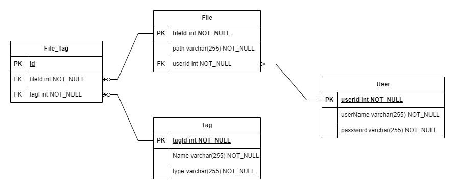

# Database configuration

## Diagrama



## Development

Creación manual usando podman. `<user>`, `<pass>`, `<root_pass>`, `<db_name>` y `<port>` deben ser los que se setear en el .env del backend:

```sh
podman run -d \
-p <port>:3306 \
-v imageGallery_volumen:/var/lib/mysql \
-e MYSQL_USER=<user> \
-e MYSQL_PASSWORD=<pass> \
-e MYSQL_ROOT_PASSWORD=<root_pass> \
-e MYSQL_DATABASE=<db_name> \
--name imageGallery_DB \
docker.io/library/mariadb
```

### Herramientas útiles

- Entrar al contenedor:

```sh
podman exec -it imageGallery_DB sh
```

- Actualizar el SO:

```sh
apt-get update
```

- Instalar herramientas

```sh
apt-get install vim mysql-client
```

### Utils

Stop and delete:

```sh
podman stop imageGallery_DB && podman rm imageGallery_DB
```

Delete volume:

```sh
podman volume rm imageGallery_volumen
```

---

## Conexión

Para conectarse se utiliza el comando `mysql` y se especifica el protocolo para poder conectarse al contenedor.
Para conectarse desde fuera del contenedor:

```sh
mysql --protocol=TCP -u <user> -p
```

Para conectarse desde dentro del contenedor:

```sh
mysql -u <user> -p
```

> Si en la configuración se cambia el puerto por defecto o el host se tienen que especificar con `-P <port>` y `-h <host>`.

---

## Links

- [mariaDB container](https://mariadb.com/kb/en/installing-and-using-mariadb-via-docker/)
- [mariaDB container environments](https://mariadb.com/kb/en/mariadb-server-docker-official-image-environment-variables/)
